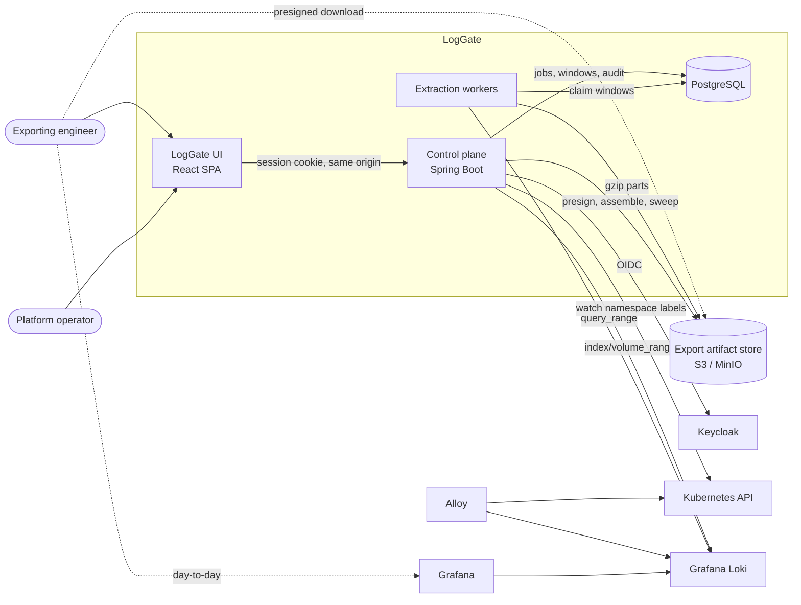
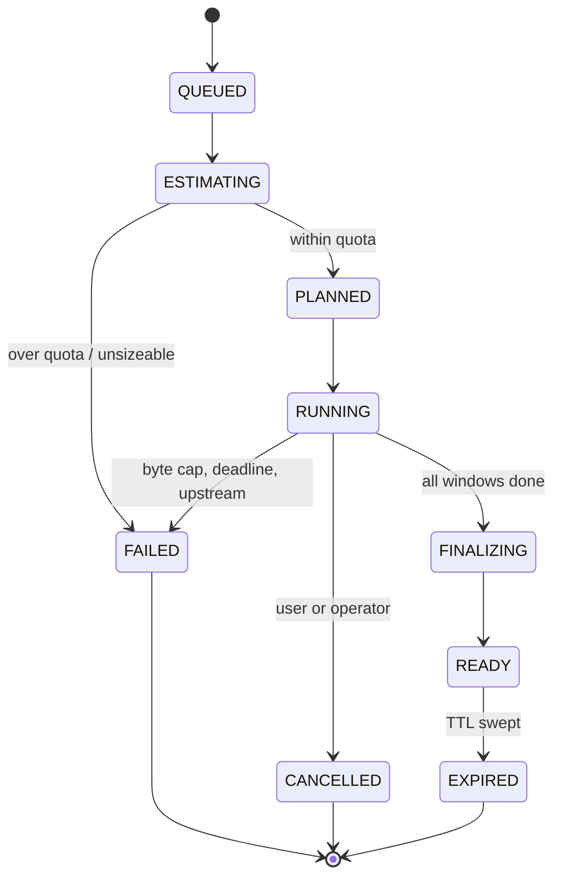

# LogGate architecture

The structural source of truth is [`architecture.calm.json`](architecture.calm.json),
a FINOS CALM model that validates against the CALM 1.0 schema. This document
explains the *why*; the model holds the shape. When the two disagree, the model
is right about structure and this document is right about intent — fix whichever
is stale.

> **Status.** LogGate is greenfield. Built so far: the control plane skeleton,
> the schema, the chart and local stack (M1), authentication with namespace
> authorization and the audit trail (M2), the extraction engine with export
> sizing (M3), the queue, quotas and workers that actually run an export (M4),
> and delivery with the UI (M5). What remains is hardening and a verified
> multi-gigabyte export. The extraction engine, quotas,
> delivery and the UI are designed and encoded in the schema, but not yet
> built. Per-component state is in the model's `implementation-status`
> metadata.

## What this system is for

Teams read their logs in Grafana. That is the right tool and LogGate does not
compete with it.

The case LogGate exists for is the other one: *give me two days of logs for
these pods, as files*. Tens of gigabytes. It happens rarely, it must not melt
the Loki read path, and it must not be solved by handing out `logcli`
credentials — because that is an unbounded, unaudited, un-quotable read against
production log data.

So the design question is not "how do I get logs out of Loki". It is "how do I
make a rare, large, dangerous operation safe, bounded and accountable".

## Topology



Two things in that picture carry most of the design weight.

**The control plane never carries bulk data.** It plans, authorizes, meters and
mints URLs. Tens of gigabytes flow worker → object store → user, never through
the API. The one exception is the proxied ZIP convenience path, which is opt-in
and size-capped.

**Postgres is the queue.** Windows are claimed with `FOR UPDATE SKIP LOCKED`
under a heartbeat lease. There is no broker, because the job state and the work
queue are the same data, and splitting them would buy a distributed-consistency
problem in exchange for nothing.

## Authorization

A namespace labelled `xyz.com/team: platform` is readable by the group rendered
from a configurable template — `ad-{team}-{env}` giving `ad-platform-dev`.

The critical decision is *where that mapping is read from*. It is the Kubernetes
API, watched and cached — not the token, and not a static config file. Group
membership is Keycloak's to assert; the namespace-to-team mapping is the
cluster's, and it changes without anyone re-issuing a token.

Three rules fall out of that:

1. **Fail closed.** An unlabelled namespace, an unresolvable template, or a
   stale cache refuses the request. There is no configuration in which an
   unknown namespace is readable.
2. **Users never write LogQL.** The API takes a structured request — namespaces,
   pod and container selectors, a time range, an optional line filter — and
   generates the selector itself. This removes the injection class rather than
   defending against it, and it keeps the size pre-flight honest, because the
   selector that gets measured is exactly the selector that will run.
3. **Entitlement is re-checked at download.** A 48-hour artifact must not
   outlive the access that produced it.

### Two deployment facts that are easy to get wrong

**The issuer URL must be byte-identical** for the browser and for the
application. Keycloak puts the browser-facing URL in the id_token's `iss`, and
Spring validates the callback against the registered `redirect_uri`. Locally
that means the ingress listens on the same port the browser uses, and the
application resolves that hostname to the ingress rather than to itself.

**Group claims need normalising.** Keycloak emits full group paths
(`/ad-platform-dev`) unless the mapper is reconfigured, and directory-derived
names vary in case. Comparison strips the path and ignores case, so an
entitlement is never lost to a leading slash.

## The export lifecycle



### Sizing before running

Loki's `index/volume_range` returns bytes per stream for a selector *before* any
data is fetched. That one call is the hinge of the whole design: it turns quota
enforcement from a guess into an arithmetic decision, it gives the user an
honest "this is 41 GB across 312 streams" confirmation, and it sets the window
duration. Without it the fallback is sampling a few windows and extrapolating,
which is materially worse.

### Windows

The job's time range is split into fixed windows, sized from the volume estimate
so each lands in the hundreds of megabytes. **Window `i` of job `J` always
covers exactly `[t_i, t_i+1)` and always writes the same object keys.**

That single property — deterministic, idempotent windows — is where most of the
reliability comes from:

| Property | Why it follows |
|---|---|
| Crash recovery | A lapsed lease means the window is re-claimed; the part is overwritten, not appended |
| Exactly-once artifacts | At-least-once workers are safe because retries are idempotent |
| Accurate progress | `windows_done / windows_total` is a real fraction, not an estimate |
| Free parallelism | Workers need no coordination, because windows do not overlap |
| Mid-flight quotas | Bytes are counted as written, so a cap aborts the job rather than being discovered afterwards |

### The page limit is a real constraint

The page limit must exceed the number of entries that can share one nanosecond.
Loki's API has no offset, so a query starting at that nanosecond returns the
same first `limit` entries every time — if they fill a page, there is no way to
reach the rest. The pager detects that it has stopped advancing and **fails**
rather than silently truncating the export. At the default limit of 5000 this
needs 5000 lines in the same nanosecond from one selector, which is
implausible; it is nonetheless a real constraint rather than a theoretical one.

### The nanosecond boundary

This is the highest-risk code in the system and deserves naming explicitly.

Paging `query_range` forward means advancing `start` to the last entry's
timestamp. Loki's `start` is **inclusive**, and several entries can share a
nanosecond. Naive paging therefore duplicates every entry at that instant, and
in high-throughput streams that is not a rare edge case — it is most pages.

The pager carries forward the identities (stream fingerprint plus line hash) of
entries at the page's maximum timestamp and skips them on the next page.
`logcli` solves the same problem the same way. It gets the heaviest test weight
of anything in the codebase: a fake Loki that returns pathological pages — all
entries sharing one nanosecond, boundaries falling exactly on page limits,
interleaved streams, 429s mid-page.

### Back-pressure

Concurrency is bounded per job and globally, and reduced additively on sustained
429s. Exports are pinned to their own Loki tenant or read pool. The intent is
that a badly-sized export degrades *itself* and never becomes an incident for
the people using Grafana.

## Generating the selector

Callers never supply LogQL. Pod and container filters are **globs**: every
character except `*` and `?` is escaped into a literal. That removes LogQL
injection and regex denial-of-service as *categories*, rather than defending
against them case by case, and it is why the structured-input decision earns
its keep.

Sizing uses the stream selector **without** the line filter. A filter reduces
what gets written but not what Loki reads, so the honest number to quota
against is the unfiltered one.

That leaves a gap worth closing rather than explaining away: the number a user
sees would then ignore their filter entirely, and they would reasonably read it
as their download size. Loki's index cannot help — it knows how big each stream
is and nothing about what is inside the lines — so the filter's selectivity is
measured by reading one short window with and without the filter and applying
the ratio to the range.

The sample is taken from the **middle** of the range. The end is the least
representative part of it: traffic may have just changed, and the newest
entries may not have flushed. It is an extrapolation from one window and is
labelled as one. Admission still judges the unfiltered number, because that is
what Loki actually has to do.

## Running an export

Windows are claimed with `FOR UPDATE SKIP LOCKED`, so many workers take work
concurrently without coordinating — each skips rows another holds rather than
queueing behind them. A claim carries a **lease**, renewed by heartbeat while
the window genuinely progresses. Nothing detects a dead worker: its lease
simply stops being renewed and the window becomes claimable again.

That is why the object key matters so much. It is derived from the job and
window index *alone* — never from an attempt number or a timestamp — so a
window run twice after a lapsed lease **overwrites its part** rather than
producing a second copy. Completing a window twice is counted once.

Two things stop an export mid-flight:

- **Cancellation** is a flag on the job, noticed between pages. The finalizer
  closes a cancelled job only once no worker still holds a window, then purges
  its parts — a cancelled export is not a partial export, and fragments of
  production logs should not sit in a bucket.
- **The byte cap** is checked every few thousand entries, not at the end. The
  running total is the job's tally at claim time plus what this window has
  produced, which under-counts what other windows are writing concurrently. So
  the cap is *approached* rather than enforced to the byte. The alternative is
  a shared counter updated per entry, which is a lot of contention to buy
  precision nobody needs.

## Artifacts and delivery

Window parts are gzip members. Concatenated gzip members are a valid gzip file,
so per-stream files are assembled server-side with S3 `UploadPartCopy` — nothing
is downloaded, re-compressed, or staged on a worker's disk. (This is why windows
are sized in the hundreds of megabytes: every copy source except the last must
be at least 5 MiB.)

Delivery is two paths, because one size genuinely does not fit:

- **Presigned URLs** plus a manifest and a generated download script — the right
  answer for tens of gigabytes, and it keeps the control plane out of the data
  path.
- **A proxied ZIP64 stream** using `STORE` rather than `DEFLATE`, since the
  members are already compressed — for the click-and-done case, size-capped into
  volumes because a single 30 GB zip is user-hostile.

The manifest records the selector, the exact time range, per-part line and byte
counts and SHA-256 checksums. It is what makes an export *evidentiary* rather
than merely delivered, and it is written **before** a job is advertised as
ready — an export nobody can verify is not finished, so a job whose manifest
cannot be written stays unpublished.

It also states what it cannot guarantee. A range reaching within fifteen
minutes of the present may be missing entries still held in Loki's ingesters,
and the manifest says so. Naming a known limit is worth more than implying a
completeness the export cannot have.

The ZIP entries are `STORE`d rather than deflated, which requires each entry's
size and CRC *before* its data. That is why the CRC is recorded when the part
is written rather than recomputed at download time — the alternative is reading
every part twice to build an archive that would be marginally larger.

## Quotas

Not one limit, but layers, because they fail differently:

| Layer | Enforced |
|---|---|
| Time range, namespace and stream count | At submit |
| Estimated bytes | At submit, from `index/volume_range` |
| Hard byte cap, wall-clock deadline | Mid-extraction |
| Concurrent jobs per user / per team / global | At claim |
| Per-team daily exported volume | At submit |
| Artifact storage TTL | Swept, with an object-store lifecycle rule as backstop |

The backstop matters: a sweeper that breaks silently must not mean production
log data lives in a bucket forever.

## Failure modes

| Failure | Behaviour |
|---|---|
| Worker crash mid-window | Lease lapses, window re-claimed, part overwritten |
| Loki 429 / overload | Backoff and concurrency reduction; the job slows, it does not fail |
| Object store outage | Window fails and retries within budget; job fails cleanly after N attempts |
| User cancels | Workers observe the flag between pages; parts purged |
| Quota exceeded | Killed at the byte cap mid-flight; partial artifacts purged |
| Very recent time range | Logs still in ingesters may be absent — reported in the manifest, never silently missing |
| Group membership revoked mid-job | Download re-check refuses; artifacts expire normally |

## Audit

`audit_event` is a first-class table, not application logs. Every submission,
state transition and download is recorded with actor, selector and byte counts.

This is deliberate: these exports contain production log data, which should be
assumed to contain PII. The record of who took what must outlive the log
retention window itself, and must not be subject to the same log pipeline it is
auditing.

## Deployment

The chart ships the control plane, the workers and optionally PostgreSQL;
Keycloak, Loki and object storage are expected to exist. The control plane must
run in-cluster, because the namespace watch is a Kubernetes API client — that is
the one hard placement constraint.

Locally, `deploy/local/deploy.sh` creates a k3d cluster and installs Loki,
Alloy, Grafana and MinIO alongside it, so the full path is exercised on a
laptop. `deploy/local/seed-logs.sh` creates labelled namespaces with chatty
workloads — both realistic volume and the fixtures the authorization model is
tested against.

Images are built with Jib from compiled classes: no Dockerfile, no container
runtime in the build, and a fixed creation time so an unchanged tree produces a
byte-identical image.

## Known limitation: one API replica

The OAuth2 authorization request is held in an in-memory HTTP session between
the redirect to Keycloak and the callback. Two API pods serving at once
therefore break login — which a rolling update guarantees briefly, and which
cost real debugging time to pin down because it looks like a flaky test.

So `replicaCount` is pinned to 1 and the deployment strategy is `Recreate`,
trading a few seconds of downtime on upgrade for a login flow that always
completes.

Lifting this needs shared session state. Spring Session JDBC was tried and
rejected: Spring Security 7's authorization request is not Java-serializable,
so the session store fails to persist it and login breaks differently. A
cookie-based authorization request repository is the likely fix. Scheduled for
M6.

## Bean wiring

There are no stereotype annotations. Every bean is declared with `@Bean` in a
configuration class under `config`, and the application class uses
`@SpringBootConfiguration` with `@Import` rather than `@SpringBootApplication`,
so nothing is component-scanned. The object graph is therefore readable in one
place instead of being inferred from annotations spread across packages.
Controllers keep `@RestController`, because request mapping is derived from it,
but they are registered as beans like everything else.

## Testing

The coverage gate is 95% LINE **and** BRANCH, wired into `gradle check`, and it
was verified to fail on deliberately uncovered code rather than assumed to work.

Coverage alone would be theatre here, so the weight is placed deliberately:

- **The pager** against a fake Loki with fault injection — pathological
  nanosecond boundaries, partial pages, 429 storms, cancellation mid-page.
- **The queue** against real Postgres via Testcontainers — concurrent claims,
  lease expiry, re-claim after simulated worker death.
- **Authorization** against fixture namespaces — including the cases that must
  be refused, which matter more than the ones that succeed.
- **End to end** through real Keycloak and a real Loki in k3d, including a
  denied cross-team attempt and an export large enough to cross many windows.
  `e2e/auth-flow.sh` already drives the real authorization code flow and
  asserts the full authorization matrix, refusals included.

## Options considered

Recorded in the model's `rejected-options` metadata, summarised here:

- **Synchronous streaming** — a ZIP straight to the browser. Rejected: a single
  connection for hours, no resume, a retry restarts tens of gigabytes, quotas
  only advisory.
- **One `logcli` Kubernetes Job per export** — rejected as the primary engine.
  It needs tens of gigabytes of staging disk (`--merge-parts` reads its own part
  files back), gives only file-count or stderr progress, cannot enforce a
  precise byte cap, and spreads credentials into per-export pods. Its
  correctness advantage is real, so it stays as a fallback engine.
- **`logcli` once per window** — keep the window planner, let Grafana own the
  pagination. Genuinely attractive, and was the standing recommendation; not
  chosen, because the decision was to own a pure-Java data path with no
  subprocess in it. The cost of that choice is precisely the nanosecond-boundary
  code above.
- **Reading chunks from Loki's object storage directly** — not rejected,
  deferred. It bypasses the queriers entirely and is the intended second tier
  for the largest exports, at the cost of coupling to the storage schema and
  missing logs still in ingesters.

The extraction engine sits behind an interface so any of these can be
substituted per size tier without touching authorization, quotas or the UI.

## Keeping this current

```bash
npx @finos/calm-cli validate -a docs/architecture.calm.json   # structural check
npx @finos/calm-cli docify   -a docs/architecture.calm.json -o docs/calm-site
```

`unique-id`s are derived from component names and are stable, so re-running the
model generation is a diff rather than a rewrite — descriptions and metadata
added by hand survive.
