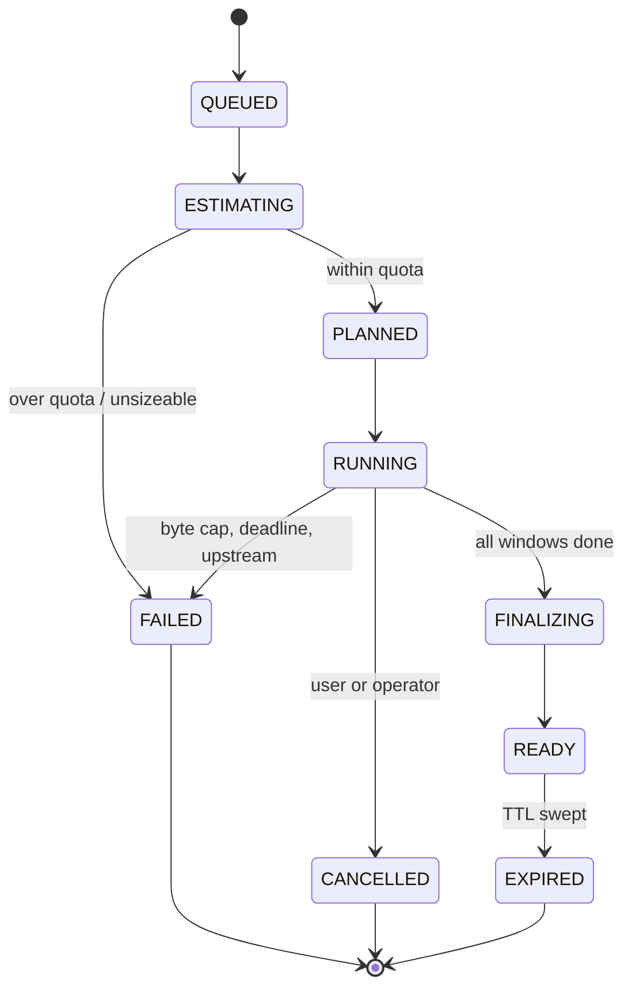

# LogGate architecture

The structural source of truth is [`architecture.calm.json`](architecture.calm.json),
a FINOS CALM model that validates against the CALM 1.0 schema. This document
explains the *why*; the model holds the shape. When the two disagree, the model
is right about structure and this document is right about intent — fix whichever
is stale.

> **Status.** LogGate is greenfield. Built so far: the control plane skeleton,
> the schema, the chart and local stack (M1), authentication with namespace
> authorization and the audit trail (M2), the extraction engine with export
> sizing (M3), the queue, quotas and workers that actually run an export (M4),
> and delivery with the UI (M5). What remains is hardening and a verified
> multi-gigabyte export. The extraction engine, quotas,
> delivery and the UI are designed and encoded in the schema, but not yet
> built. Per-component state is in the model's `implementation-status`
> metadata.

## What this system is for

Teams read their logs in Grafana. That is the right tool and LogGate does not
compete with it.

The case LogGate exists for is the other one: *give me two days of logs for
these pods, as files*. Tens of gigabytes. It happens rarely, it must not melt
the Loki read path, and it must not be solved by handing out `logcli`
credentials — because that is an unbounded, unaudited, un-quotable read against
production log data.

So the design question is not "how do I get logs out of Loki". It is "how do I
make a rare, large, dangerous operation safe, bounded and accountable".

## Topology

```mermaid
flowchart LR
  eng([Exporting engineer])
  ops([Platform operator])

  subgraph LogGate
    ui[LogGate UI<br/>React SPA]
    api[Control plane<br/>Spring Boot]
    wrk[Extraction workers]
    pg[(PostgreSQL)]
  end

  s3[(Export artifact store<br/>S3 / MinIO)]
  kc[Keycloak]
  k8s[Kubernetes API]
  loki[Grafana Loki]
  alloy[Alloy]
  graf[Grafana]
  prom[Prometheus-compatible<br/>metrics store]

  eng --> ui
  ops --> ui
  ui -->|session cookie, same origin| api
  api -->|OIDC| kc
  api -->|watch namespace labels| k8s
  api -->|jobs, windows, audit| pg
  api -->|index/volume_range| loki
  wrk -->|claim windows| pg
  wrk -->|query_range| loki
  wrk -->|gzip parts| s3
  api -->|series: pods per namespace| prom
  prom -.->|scrape :9090| api
  api -->|presign, assemble, sweep| s3
  eng -.->|presigned download| s3
  alloy --> loki
  alloy --> k8s
  eng -.->|day-to-day| graf
  graf --> loki
  graf --> prom
```



Two things in that picture carry most of the design weight.

**The control plane never carries bulk data.** It plans, authorizes, meters and
mints URLs. Tens of gigabytes flow worker → object store → user, never through
the API. The one exception is the proxied ZIP convenience path, which is opt-in
and size-capped.

**Postgres is the queue.** Windows are claimed with `FOR UPDATE SKIP LOCKED`
under a heartbeat lease. There is no broker, because the job state and the work
queue are the same data, and splitting them would buy a distributed-consistency
problem in exchange for nothing.

## Authorization

A namespace labelled `xyz.com/team: platform` is readable by the group rendered
from a configurable template — `ad-{team}-{env}` giving `ad-platform-dev`.

The critical decision is *where that mapping is read from*. It is the Kubernetes
API, watched and cached — not the token, and not a static config file. Group
membership is Keycloak's to assert; the namespace-to-team mapping is the
cluster's, and it changes without anyone re-issuing a token.

Three rules fall out of that:

1. **Fail closed.** An unlabelled namespace, an unresolvable template, or a
   stale cache refuses the request. There is no configuration in which an
   unknown namespace is readable.
2. **Users never write LogQL.** The API takes a structured request — namespaces,
   pod and container selectors, a time range, an optional line filter — and
   generates the selector itself. This removes the injection class rather than
   defending against it, and it keeps the size pre-flight honest, because the
   selector that gets measured is exactly the selector that will run.
3. **Entitlement is re-checked at download.** A 48-hour artifact must not
   outlive the access that produced it.

### Two access modes

Team ownership is one answer to "who may read this", and it depends on being
able to see the namespaces. When Loki collects from many clusters and LogGate
can reach none of their APIs, it cannot. So `access.mode` chooses between two
answers, behind one interface (`NamespaceAccess`) that every caller asks:

| | team-label | open |
| --- | --- | --- |
| What is on offer | namespaces labelled as your team's, in this cluster | every namespace Loki holds, in every cluster |
| Where that comes from | the Kubernetes API, watched | Loki's label values API, cached |
| What grants access | a group claim matching the namespace's team | one client role on LogGate's OIDC client |
| Namespaces | required | optional; none means all |
| Budget charged to | the owning teams | the person |
| Kubernetes access | a ClusterRole to read namespaces | none; no client is created |

**The cluster pin.** When Loki holds several clusters' logs, told apart by a
configured stream label, team-label mode offers only its own cluster and
rewrites every request to it, whatever was asked. The Kubernetes API can vouch
only for its own cluster's namespaces; without the pin, a team entitled to
`platform-dev` here would also receive `platform-dev` from every other cluster
that has one. The rewrite happens in `ExportService` before anything reads the
request, so the query that runs, the size that is admitted and the job that is
stored all describe the same thing. The chart refuses to render a cluster label
in team-label mode without the cluster's own name to pin to.

**The role, and where it is read from.** Keycloak puts client roles in the
access token (`resource_access.<client>.roles`), not the ID token, unless its
mapper is changed. Those are effective roles, so one granted to a group reaches
every member. The access token is in hand only during sign-in, so
`ClientRoleOidcUserService` copies the roles onto the signed-in user as
authorities, which the session keeps. The token's signature is not checked: it
came from the token endpoint over LogGate's own connection in the same response
as the verified ID token. Open mode refuses to start without a role configured,
so no setting, and no omission, makes every log readable by every signed-in
user. The role is re-checked at download like any entitlement: revoke it, and
exports made with it stop being downloadable.

**Discovery is a convenience, not a grant.** In open mode the lists of clusters
and namespaces come from Loki's index, cached for a minute and served stale if
Loki blips. They decide what the page offers. The role decides what is allowed.
A cluster Loki has never heard of is refused, which catches a typo before it
becomes an export of nothing.

**Clusters before namespaces.** Where there are clusters to choose from, open
mode lists namespaces only for chosen clusters: `/api/me` carries none, and
`/api/namespaces` without a cluster is refused. Every namespace across every
cluster is the widest label-values query the page could put to Loki, it used
to be asked on every page load, and with twenty or thirty clusters nobody
reads that list before narrowing it. The page makes "every cluster" an
explicit *Select all* rather than the default. Team-label mode is unaffected:
its namespaces come from this cluster's Kubernetes API and cost Loki nothing.

### Pods, from metrics

Loki knows a pod only as a label on its streams, so listing pods from it is an
index scan across every namespace and day asked about. A metrics store already
holds exactly this as one series per pod, kube-state-metrics' `kube_pod_info`,
and its series API returns label sets without reading a sample. So
`PrometheusPodSource` asks any Prometheus-compatible API (Prometheus, Thanos,
Mimir, OpenShift's thanos-querier) for that series, restricted to the chosen
namespaces and clusters **over the export's own range**, so what is offered is
what ran then.

The metric and its pod, namespace and cluster labels are configuration, since
not every fleet runs kube-state-metrics or labels clusters the same way as
its logs. The configured selector is validated at startup, and LogGate only
ever adds matchers to it, escaped as regex literals, with namespaces held to
DNS-label syntax. The listing is authorized exactly as an export of the same
namespaces would be, and refusals are audited, because a pod list is a view
into a namespace. It is advice for choosing, never a grant: the export is
authorized on its namespaces whatever pods it names. Listings are cached for a
minute, keyed to the minute, and served stale if the endpoint fails. With no
endpoint configured the page offers the pod pattern alone. Compatibility with
Grafana Mimir, whose API sits under `/prometheus` and requires a tenant, is
checked against a real Mimir by `deploy/local/mimir-check.sh` in CI, including
every dashboard query.

### Two deployment facts that are easy to get wrong

**The issuer URL must be byte-identical** for the browser and for the
application. Keycloak puts the browser-facing URL in the id_token's `iss`, and
Spring validates the callback against the registered `redirect_uri`. Locally
that means the ingress listens on the same port the browser uses, and the
application resolves that hostname to the ingress rather than to itself.

**Group claims need normalising.** Keycloak emits full group paths
(`/ad-platform-dev`) unless the mapper is reconfigured, and directory-derived
names vary in case. Comparison strips the path and ignores case, so an
entitlement is never lost to a leading slash.

## The export lifecycle



### Sizing before running

Loki's `index/volume_range` returns bytes per stream for a selector *before* any
data is fetched. That one call is the hinge of the whole design: it turns quota
enforcement from a guess into an arithmetic decision, it gives the user an
honest "this is 41 GB across 312 streams" confirmation, and it sets the window
duration. Without it the fallback is sampling a few windows and extrapolating,
which is materially worse.

### Windows

The job's time range is split into fixed windows, sized from the volume estimate
so each lands in the hundreds of megabytes. **Window `i` of job `J` always
covers exactly `[t_i, t_i+1)` and always writes the same object keys.**

That single property — deterministic, idempotent windows — is where most of the
reliability comes from:

| Property | Why it follows |
|---|---|
| Crash recovery | A lapsed lease means the window is re-claimed; the part is overwritten, not appended |
| Exactly-once artifacts | At-least-once workers are safe because retries are idempotent |
| Accurate progress | `windows_done / windows_total` is a real fraction, not an estimate |
| Free parallelism | Workers need no coordination, because windows do not overlap |
| Mid-flight quotas | Bytes are counted as written, so a cap aborts the job rather than being discovered afterwards |

### The page limit is a real constraint

The page limit must exceed the number of entries that can share one nanosecond.
Loki's API has no offset, so a query starting at that nanosecond returns the
same first `limit` entries every time — if they fill a page, there is no way to
reach the rest. The pager detects that it has stopped advancing and **fails**
rather than silently truncating the export. At the default limit of 5000 this
needs 5000 lines in the same nanosecond from one selector, which is
implausible; it is nonetheless a real constraint rather than a theoretical one.

### The nanosecond boundary

This is the highest-risk code in the system and deserves naming explicitly.

Paging `query_range` forward means advancing `start` to the last entry's
timestamp. Loki's `start` is **inclusive**, and several entries can share a
nanosecond. Naive paging therefore duplicates every entry at that instant, and
in high-throughput streams that is not a rare edge case — it is most pages.

The pager carries forward the identities (stream fingerprint plus line hash) of
entries at the page's maximum timestamp and skips them on the next page.
`logcli` solves the same problem the same way. It gets the heaviest test weight
of anything in the codebase: a fake Loki that returns pathological pages — all
entries sharing one nanosecond, boundaries falling exactly on page limits,
interleaved streams, 429s mid-page.

### Back-pressure

Concurrency is bounded per job and globally, and reduced additively on sustained
429s. Exports are pinned to their own Loki tenant or read pool. The intent is
that a badly-sized export degrades *itself* and never becomes an incident for
the people using Grafana.

## Generating the selector

Callers never supply LogQL. Pod and container filters are **globs**: every
character except `*` and `?` is escaped into a literal. That removes LogQL
injection and regex denial-of-service as *categories*, rather than defending
against them case by case, and it is why the structured-input decision earns
its keep. The pod is matched by a label filter after the stream selector,
`{namespace="a"} | pod="x"`, not by a matcher inside it: where logs carry
the pod as structured metadata rather than as an indexed label, a matcher in
the selector matches no stream, while a label filter matches it either way.
The index therefore sizes the namespace, and what the pod filter keeps is
sampled like a line filter. Pods picked from the list become an alternation
of literals, and a name that is not a valid pod name is refused rather than
escaped. A request
may pick pods or give a pattern, not both. Picked pods are stored in their own
column as well as in the selector, so "which pods did this take" can be
answered without reading a regex.

Sizing uses the stream selector **without** the line filter. A filter reduces
what gets written but not what Loki reads, so the honest number to quota
against is the unfiltered one.

That leaves a gap worth closing rather than explaining away: the number a user
sees would then ignore their filter entirely, and they would reasonably read it
as their download size. Loki's index cannot help — it knows how big each stream
is and nothing about what is inside the lines — so the filter's selectivity is
measured by reading one short window with and without the filter and applying
the ratio to the range.

The sample is taken from the **middle** of the range. The end is the least
representative part of it: traffic may have just changed, and the newest
entries may not have flushed. It is an extrapolation from one window and is
labelled as one. Admission still judges the unfiltered number, because that is
what Loki actually has to do.

## Running an export

Windows are claimed with `FOR UPDATE SKIP LOCKED`, so many workers take work
concurrently without coordinating — each skips rows another holds rather than
queueing behind them. A claim carries a **lease**, renewed by heartbeat while
the window genuinely progresses. Nothing detects a dead worker: its lease
simply stops being renewed and the window becomes claimable again.

That is why the object key matters so much. It is derived from the job and
window index *alone* — never from an attempt number or a timestamp — so a
window run twice after a lapsed lease **overwrites its part** rather than
producing a second copy. Completing a window twice is counted once.

Two things stop an export mid-flight:

- **Cancellation** is a flag on the job, noticed between pages. The finalizer
  closes a cancelled job only once no worker still holds a window, then purges
  its parts — a cancelled export is not a partial export, and fragments of
  production logs should not sit in a bucket.
- **The byte cap** is checked every few thousand entries, not at the end. The
  running total is the job's tally at claim time plus what this window has
  produced, which under-counts what other windows are writing concurrently. So
  the cap is *approached* rather than enforced to the byte. The alternative is
  a shared counter updated per entry, which is a lot of contention to buy
  precision nobody needs.

## Artifacts and delivery

Window parts are gzip members. Concatenated gzip members are a valid gzip file,
so per-stream files are assembled server-side with S3 `UploadPartCopy` — nothing
is downloaded, re-compressed, or staged on a worker's disk. (This is why windows
are sized in the hundreds of megabytes: every copy source except the last must
be at least 5 MiB.)

Delivery is two paths, because one size genuinely does not fit:

- **Presigned URLs** plus a manifest and a generated download script — the right
  answer for tens of gigabytes, and it keeps the control plane out of the data
  path.
- **A proxied ZIP64 stream** using `STORE` rather than `DEFLATE`, since the
  members are already compressed — for the click-and-done case, size-capped into
  volumes because a single 30 GB zip is user-hostile.

The manifest records the selector, the exact time range, per-part line and byte
counts and SHA-256 checksums. It is what makes an export *evidentiary* rather
than merely delivered, and it is written **before** a job is advertised as
ready — an export nobody can verify is not finished, so a job whose manifest
cannot be written stays unpublished.

It also states what it cannot guarantee. A range reaching within fifteen
minutes of the present may be missing entries still held in Loki's ingesters,
and the manifest says so. Naming a known limit is worth more than implying a
completeness the export cannot have.

The ZIP entries are `STORE`d rather than deflated, which requires each entry's
size and CRC *before* its data. That is why the CRC is recorded when the part
is written rather than recomputed at download time — the alternative is reading
every part twice to build an archive that would be marginally larger.

## Quotas

Not one limit, but layers, because they fail differently:

| Layer | Enforced |
|---|---|
| Time range, namespace and stream count | At submit |
| Estimated bytes | At submit, from `index/volume_range` |
| Hard byte cap, wall-clock deadline | Mid-extraction |
| Concurrent jobs per user / per team / global | At claim |
| Per-team exported volume, rolling 24h | At submit |
| Artifact storage TTL | Swept, with an object-store lifecycle rule as backstop |

The backstop matters: a sweeper that breaks silently must not mean production
log data lives in a bucket forever.

The team budget is **rolling**, not calendar: no midnight cliff, and no
question about whose midnight. It counts what has been written *plus* the
estimate of admitted-but-unfinished exports — counting only finished ones
would let someone start ten large jobs at once and stay under budget purely
because none had finished. Failed exports are excluded, since a team should not
lose budget to something that produced nothing usable.

An export spanning several teams is charged **in full to each**. A team that
took part in pulling that data caused all of it, and splitting the cost would
let one export slip under every budget it touches.

Teams are resolved from the namespace labels at admission and stored on the
job. The budget is an accounting question about the past, and re-deriving it
later would let a relabelled namespace quietly rewrite who spent what.

## Failure modes

| Failure | Behaviour |
|---|---|
| Worker crash mid-window | Lease lapses, window re-claimed, part overwritten |
| Loki 429 / overload | Backoff and concurrency reduction; the job slows, it does not fail |
| Object store outage | Window fails and retries within budget; job fails cleanly after N attempts |
| User cancels | Workers observe the flag between pages; parts purged |
| Quota exceeded | Killed at the byte cap mid-flight; partial artifacts purged, and reported as a quota failure rather than a storage one even though it stops mid-upload |
| Very recent time range | Logs still in ingesters may be absent — reported in the manifest, never silently missing |
| Group membership revoked mid-job | Download re-check refuses; artifacts expire normally |

## Output formats and signing out

**Formats.** Each export chooses what its files hold: JSON lines carrying the
timestamp, the stream labels and the line, or the raw lines alone. The choice
is stored on the job, so the worker writing a retried window, the manifest
and the download script agree on it, and it names the parts (`.jsonl.gz` or
`.log.gz`). Raw output is also the one whose written size is the log lines'
own, with no envelope added.

**Public pages.** Someone arriving without a session lands on `/welcome`
rather than being sent straight to the identity provider; API calls still get
a 401. `/welcome`, `/guide` and `/signed-out` are static pages served without a
session and load nothing that needs one. The guide is built from
`docs/USER-GUIDE.md` with every UI build, so the published guide and the
repository's are the same document.

**Signing out** ends the identity provider's session as well as LogGate's,
through OIDC RP-initiated logout; ending only LogGate's would sign the same
person straight back in on the next page load. The page posts to `/logout`
with its CSRF header and is answered with the provider's end-session URL,
because a fetch cannot follow a redirect to another origin; the provider then
returns to a static signed-out page that is served without a session. The
provider must allow that page as a post-logout redirect URI; the demo realm
does, and a production client needs `<app>/*` added.

## Observability

Micrometer publishes the export counters, timers and queue gauges on a
**management port (9090)** of its own. The Service's `http` port, the Ingress
and the Route reach only port 8080, where `/actuator` is not served at all, so
Prometheus scrapes without a session and the metrics are never on the public
host. Probes use the management port; `/livez` and `/readyz` are also served on
the application port for anything that can only reach that. The chart can
annotate the pods for an annotation-driven Prometheus, create a
`ServiceMonitor`, open the port to a scraper in the NetworkPolicy, and ship
the Grafana dashboard as a sidecar-loaded ConfigMap.

The queue gauges read the shared database, so every replica reports the same
value: the dashboard takes their `max`, not their `sum`. The app's own
Activity page reads PostgreSQL directly instead of Prometheus: per-replica
counters only know what one pod did since it started, while the database
knows what every pod did, across restarts, and needs no metrics stack. It
reports aggregates only, to anyone who may export.

## Audit

`audit_event` is a first-class table, not application logs. Every submission,
state transition and download is recorded with actor, selector and byte counts.

This is deliberate: these exports contain production log data, which should be
assumed to contain PII.

**Downloads** are recorded by how the data left. A `.zip` streams through
LogGate, so `ARCHIVE_DOWNLOADED` is a download, recorded as it starts. The
script and the per-file links hand out presigned URLs whose files are fetched
from object storage directly, so `DOWNLOAD_SCRIPT_ISSUED` and
`DOWNLOAD_LINKS_ISSUED` record the hand-over of the links, the last point
LogGate can vouch for; the object store's own access log is the record of the
fetch. Each row carries the export's namespaces, clusters and size as well as
its id, because the job expires and the record of who took it must not. The
page asks for per-file links only when someone opens the file list: minting
them on every render would put a "download" in the trail for every page view.

**Administrators** are holders of `access.adminRole`, a client role read from
the access token exactly as the open-mode role is, and separate from it:
auditing does not need exporting, and exporting does not make someone an
auditor. They alone see the Activity report and the audit page. A blank role
makes nobody an administrator. The record of who took what must outlive the log
retention window itself, and must not be subject to the same log pipeline it is
auditing.

## Deployment

The chart ships the control plane, the workers and optionally PostgreSQL;
Keycloak, Loki and object storage are expected to exist. In team-label mode the
control plane must run in the cluster whose namespaces it authorizes, because
the namespace watch is a Kubernetes API client. In open mode there is no such
constraint: it needs only Loki, Keycloak, PostgreSQL and the object store.

**OpenShift.** `openshift.enabled` leaves out every fixed `runAsUser`,
`runAsGroup` and `fsGroup` so the `restricted-v2` SCC can assign them; every
container already runs non-root, with all capabilities dropped, no privilege
escalation, a read-only root filesystem and the `RuntimeDefault` seccomp
profile. `route.enabled` serves the application through a Route whose timeout
is raised to an hour, because the `.zip` download streams through the
application and the router's 30-second default would cut it off. The network
policy allows DNS to `openshift-dns` on port 5353 in that mode; upstream
Kubernetes uses kube-dns on 53, and a policy written for one blocks all name
resolution on the other. The chart's own probe and test pod use the
application's image, whose user is numeric: an image whose user is a name
cannot be checked against `runAsNonRoot` when no UID is set.
`deploy/local/openshift-check.sh` verifies all of this without OpenShift, by
installing into a namespace enforcing the restricted Pod Security Standard with
every pod given an OpenShift-style UID. The one thing it cannot check is the
OpenShift Logging `LokiStack` gateway, which requires OpenShift bearer tokens
that LogGate does not send; point LogGate at Grafana's Loki gateway instead.

### Object storage compatibility

Any S3-compatible store works: MinIO, NetApp ONTAP S3 and StorageGRID among
them. (NetApp Trident provisions file and block volumes, not S3; on NetApp, the
object store is ONTAP S3 or StorageGRID.) LogGate uses multipart upload,
GetObject, HeadObject, ListObjectsV2, per-object DeleteObject and presigned GET
URLs. ONTAP S3 has supported all of them since 9.8, except presigned URLs,
which need **9.11.1**.

The difference that matters is at the edges. Since 2.30 the AWS SDK adds a
trailing CRC32 to every upload, sent with aws-chunked encoding, which AWS
accepts and which ONTAP S3 does not list among the payload modes it supports.
`storage.checksums: whenRequired`, the default, keeps uploads plain.
`S3ClientsTest` records the headers of real multipart uploads made through the
production client factory and requires every payload mode to be one ONTAP
documents; a control run with the AWS default proves the check would catch the
trailer. On-premises stores are usually behind an internal certificate
authority, which `storage.caCertificate` trusts for storage calls alone,
leaving the rest of the JVM's trust untouched. The bundle may come from a
Secret or a ConfigMap: a CA certificate is public, and a ConfigMap is where
OpenShift's trusted-CA-bundle injection writes one.

Locally, `deploy/local/deploy.sh` creates a k3d cluster and installs Loki,
Alloy, Grafana and MinIO alongside it, so the full path is exercised on a
laptop. `deploy/local/seed-logs.sh` creates labelled namespaces with chatty
workloads — both realistic volume and the fixtures the authorization model is
tested against.

Images are built with Jib from compiled classes: no Dockerfile, no container
runtime in the build, and a fixed creation time so an unchanged tree produces a
byte-identical image.

## Sessions and replicas

The OAuth2 authorization request is held in the HTTP session between the
redirect to Keycloak and the callback, so every replica must see every session.
Sessions are stored in PostgreSQL with Spring Session JDBC, serialized as JSON
through Spring Security's Jackson modules: Spring Security 7's authorization
request is not Java-serializable, which is what defeated the first attempt.
The chart runs two replicas with a rolling update, and a login that starts on
one pod finishes on the other.

## Bean wiring

There are no stereotype annotations. Every bean is declared with `@Bean` in a
configuration class under `config`, and the application class uses
`@SpringBootConfiguration` with `@Import` rather than `@SpringBootApplication`,
so nothing is component-scanned. The object graph is therefore readable in one
place instead of being inferred from annotations spread across packages.
Controllers keep `@RestController`, because request mapping is derived from it,
but they are registered as beans like everything else.

## Testing

The coverage gate is 95% LINE **and** BRANCH, wired into `gradle check`, and it
was verified to fail on deliberately uncovered code rather than assumed to work.

Coverage alone would be theatre here, so the weight is placed deliberately:

- **The pager** against a fake Loki with fault injection — pathological
  nanosecond boundaries, partial pages, 429 storms, cancellation mid-page.
- **The queue** against real Postgres via Testcontainers — concurrent claims,
  lease expiry, re-claim after simulated worker death.
- **Authorization** against fixture namespaces — including the cases that must
  be refused, which matter more than the ones that succeed.
- **End to end** through real Keycloak and a real Loki in k3d, including a
  denied cross-team attempt and an export large enough to cross many windows.
  `e2e/auth-flow.sh` already drives the real authorization code flow and
  asserts the full authorization matrix, refusals included.

## Options considered

Recorded in the model's `rejected-options` metadata, summarised here:

- **Synchronous streaming** — a ZIP straight to the browser. Rejected: a single
  connection for hours, no resume, a retry restarts tens of gigabytes, quotas
  only advisory.
- **One `logcli` Kubernetes Job per export** — rejected as the primary engine.
  It needs tens of gigabytes of staging disk (`--merge-parts` reads its own part
  files back), gives only file-count or stderr progress, cannot enforce a
  precise byte cap, and spreads credentials into per-export pods. Its
  correctness advantage is real, so it stays as a fallback engine.
- **`logcli` once per window** — keep the window planner, let Grafana own the
  pagination. Genuinely attractive, and was the standing recommendation; not
  chosen, because the decision was to own a pure-Java data path with no
  subprocess in it. The cost of that choice is precisely the nanosecond-boundary
  code above.
- **Reading chunks from Loki's object storage directly** — not rejected,
  deferred. It bypasses the queriers entirely and is the intended second tier
  for the largest exports, at the cost of coupling to the storage schema and
  missing logs still in ingesters.

The extraction engine sits behind an interface so any of these can be
substituted per size tier without touching authorization, quotas or the UI.

For open access across clusters:

- **Reading each cluster's Kubernetes API** for namespace labels. Rejected:
  LogGate would need credentials for, and a network path to, every cluster it
  serves, which is exactly what running beside a central Loki avoids. Loki
  already knows every cluster and namespace that has sent it a line.
- **A group, rather than a client role, as the open-mode gate.** A group was
  the first design; the role was chosen because it is scoped to LogGate's own
  client, so granting it cannot mean anything to any other application, while
  a group can still carry it for every member.
- **Charging open-mode exports to the cluster**, or to nobody. Rejected: a
  budget with nobody accountable is no budget, and the person exporting is the
  one who can narrow the request.

## Keeping this current

```bash
npx @finos/calm-cli validate -a docs/architecture.calm.json   # structural check
npx @finos/calm-cli docify   -a docs/architecture.calm.json -o docs/calm-site
```

`unique-id`s are derived from component names and are stable, so re-running the
model generation is a diff rather than a rewrite — descriptions and metadata
added by hand survive.
