# LogGate user guide

LogGate is for the times a dashboard is the wrong tool: when you need **hours or
days of logs, for a set of pods, as files**, rather than a screen of search
results. You choose what you want, LogGate tells you what it will cost before
it starts, extracts it in the background, and hands you files you can open with
`zcat`, `jq`, `grep` or anything else.

<picture>
  <source media="(prefers-color-scheme: dark)" srcset="images/00-overview-dark.png">
  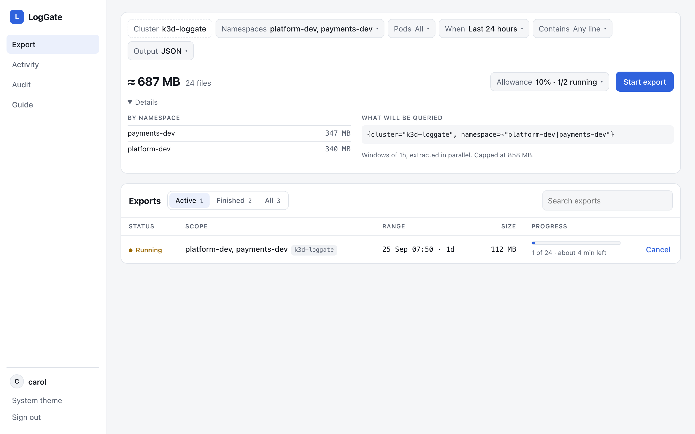
</picture>

Every screenshot in this guide is of the real application, captured by
[`ui/screenshots/tour.spec.ts`](../ui/screenshots/tour.spec.ts) against a local
deployment with demo data.

## Contents

- [Signing in](#signing-in)
- [What you can export](#what-you-can-export)
- [Making an export](#making-an-export)
- [The size, before it runs](#the-size-before-it-runs)
- [Your allowance](#your-allowance)
- [While it runs](#while-it-runs)
- [Activity and audit, for administrators](#activity-and-audit-for-administrators)
- [Downloading](#downloading)
- [What is in an export](#what-is-in-an-export)
- [When something goes wrong](#when-something-goes-wrong)
- [Themes and phones](#themes-and-phones)
- [Questions](#questions)

## Signing in

LogGate uses your organisation's single sign-on (Keycloak). Open LogGate and
choose **Sign in with single sign-on**. There is no separate LogGate password.

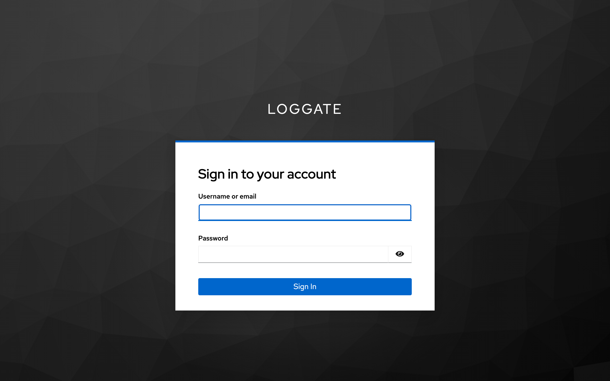

**Sign out** also signs you out of single sign-on, and returns you to the
landing page.

## What you can export

What is on offer depends on how your LogGate is set up. There are two modes.

### Your team's namespaces

In the default mode you can export from a namespace when **your team owns it**.
Ownership comes from a label on the namespace, and the label's value names the
group that may read it:

| Namespace label            | Group that may export it |
| -------------------------- | ------------------------ |
| `xyz.com/team: platform`   | `ad-platform-dev`        |
| `xyz.com/team: payments`   | `ad-payments-dev`        |

The label key and the group naming pattern are set by whoever runs LogGate, so
yours may differ. The list is read live from Kubernetes, so a namespace
relabelled a minute ago is already reflected. A namespace with no team label is
never offered to anyone.

If you are not in any owning group, LogGate says so rather than showing an
empty page:

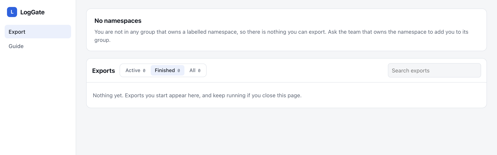

When your Loki holds more than one cluster's logs, this mode exports only from
the cluster LogGate runs in, shown as the first item of the query bar. It is the only
cluster whose namespace owners LogGate can check: another cluster's
`platform-dev` may belong to someone else entirely.

### Every log, for people with the role

In open mode, **every namespace Loki holds logs for, from every cluster that
sends to it**, is available to anyone with LogGate's export role. Nobody's
team matters. It suits a central Loki collecting from many clusters, where
LogGate cannot see any of them directly.

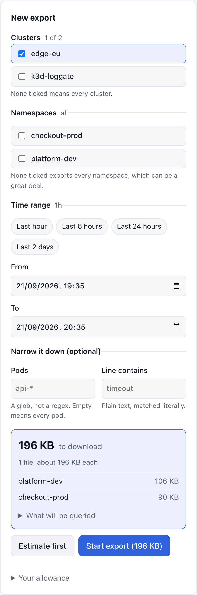

- **Clusters.** Choose at least one. Its namespaces are listed once you
  have: asking Loki for every namespace in every cluster is the most
  expensive question the page could ask, and nobody reads that list before
  picking a cluster anyway. A long list of clusters is grouped into the
  families their names already follow (`prod-eu-west-1` and `prod-eu-west-2`
  are both `prod-eu-west`), each family with a tick box for the whole of it,
  and there is a filter box and a *Select all* for when you really mean every
  cluster.
- **Namespaces.** Tick the ones you want, or none for every namespace in the
  clusters you chose. The form says which you are about to get, and
  *Estimate size* shows the size before anything runs.
- **Budget.** With no teams to charge, your exports count against your own
  allowance.

The role is granted in Keycloak, usually to a group you are added to. Without
it you see nothing to export, and the page tells you what to ask for:

<br clear="right">

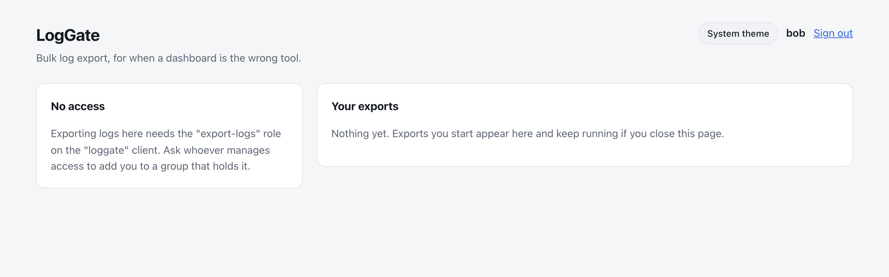

Losing the role also stops you downloading exports you made while you held it.

## Making an export

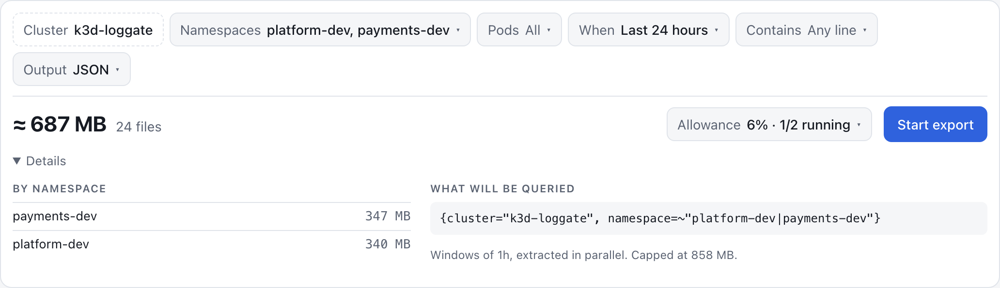

An export is one line of choices, the **query bar**. Each part says what is
chosen; click it to change it. You never write a query: LogGate builds it
from these choices and shows you what it built under *Details*.

- **Cluster** (or **Clusters** in open mode). In team mode it is fixed to the
  cluster LogGate runs in. In open mode, choose at least one; a long list is
  grouped into the families its names follow, such as `prod-eu-west`, each
  with a tick box for the whole family.
- **Namespaces.** Each shows the team that owns it. In open mode none chosen
  means every namespace in the clusters you chose.
- **Pods** (optional). Where LogGate is connected to a metrics store, this
  lists the pods that ran in your namespaces **during your time range**,
  grouped by namespace. *Match a pattern* takes a glob such as `api-*`
  instead, for pods that have not started yet or where there is no list.
  Your operator can switch patterns off.
- **When.** A preset, or *From* and *To* of your own. The presets stop at two
  days on purpose: exports are for bulk retrieval, and anything measured in
  minutes is quicker to find in Grafana. A range longer than one export may
  cover is caught here, as you choose it.
- **Contains** (optional) keeps only lines containing that text, matched
  literally. `timeout` finds `timeout`, not a pattern.
- **Output.** *JSON lines* (the default) writes each entry with its
  timestamp, its labels and the line, and reads with `jq`. *Raw log lines*
  writes the lines exactly as logged, for `grep` and `less`. See
  [What is in an export](#what-is-in-an-export).

Every list opens with a search box once it is long: type to filter, press
Enter to pick the first match, use the arrow keys to move, or *Select all*
and *Clear*. Escape or *Done* closes it.

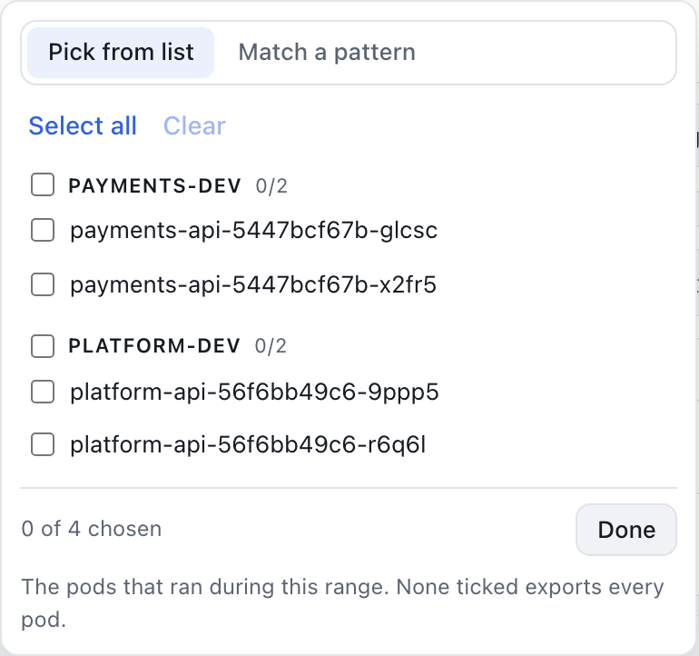
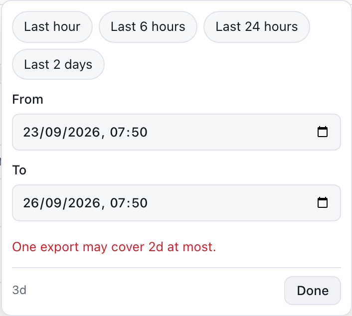

## The size, before it runs

**Estimate size** asks Loki how much data your choices cover, **before any of
it is read**, and shows the answer beside **Start export**. It is asked for
rather than automatic, because each estimate is work for Loki. Change anything
afterwards and the size is cleared rather than left describing a different
query. This is the moment to find out an export is 40 GB rather than after
waiting for it; you can also start without it, and quota is checked either
way.

- **The size to download**, in large type, and how many files it makes. With
  a *Contains* filter or chosen pods, it is extrapolated from a sample of the
  range and says so.
- **Details** shows the size per namespace, what is read from Loki when a
  filter is set (Loki reads the whole stream before a filter can drop lines,
  and quota is judged on that), the exact query, the size of the time windows
  it is extracted in, and the cap the export runs under.
- **Whether it would be allowed.** If quota would refuse it, the reason
  appears in red and *Start export* is not offered. The final decision is made
  when you start it, so a refusal because too many exports are running may
  have cleared by then.

## Your allowance

**Allowance**, beside *Start export*, shows how much of your budget is used and
how many of your exports are running. Click it for each budget and the limits
you are working within:

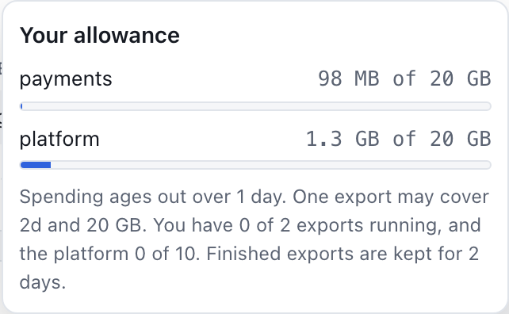

| Limit | What it means |
| --- | --- |
| **Team budget** | How much each of your teams may export over a rolling period. Spending ages out gradually, so there is no midnight reset to wait for. An export across two teams counts in full against both. |
| **Longest range** | The most time one export may cover. |
| **Largest export** | The most data one export may read from Loki. |
| **Exports running** | How many you may have in progress at once, and how many the whole platform may. |
| **Retention** | How long a finished export's files are kept before they are deleted. |

The numbers are set by whoever runs LogGate. The screenshots show the demo
settings: two days, 20 GB per export and per team per day, two exports each and
ten across the platform, kept for two days.

## While it runs

Exports run in the background. **You can close the page**: the export carries
on, and it will be in the list when you come back.

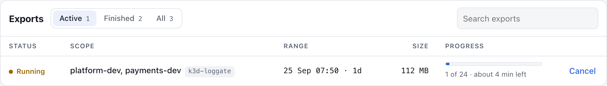

Your exports are in the table under the query bar. *Active* shows what is
running, *Finished* what has ended, and *All* both; the search box finds an
export by namespace, cluster, state or format. A running export shows how many
of its time windows are done and roughly how long is left. The time left is worked out from how long the finished windows
took, so it settles down after the first few.

Each export moves through these states:

| State | Meaning |
| --- | --- |
| Queued | Accepted, waiting to be planned. |
| Planned | Split into time windows, waiting for a worker. |
| Running | Windows are being extracted. |
| Finalizing | Every window is done; the manifest is being written. |
| Ready | Files are available to download. |
| Failed | Stopped; the reason is shown, with the full explanation on hover. |
| Cancelled | Stopped at your request. Anything it had written is deleted. |
| Expired | Its files have reached the end of their retention and been deleted. |

**Run again** on a finished export fills the query bar with its clusters,
namespaces and format, over the same length of time ending now.

**Cancel** stops an export between pages of results, usually within seconds.

The list shows your eight most recent exports, with a button to show older ones.

## Activity and audit, for administrators

Administrators, who hold LogGate's administrator role (`loggate-admin` unless
your operator chose another name), see two more tabs. Nobody else sees them,
and a link to one opens the export form instead.

The **Activity** tab shows how exporting has gone for everyone on this
LogGate, over the last day, week or month: what is in flight right now, how
many exports were accepted, finished, failed or refused, how much was
written, how long exports take to become ready, and why the ones that failed
did. It is counts only: nobody's exports or namespaces are named. The link
(`#activity`) opens it directly.

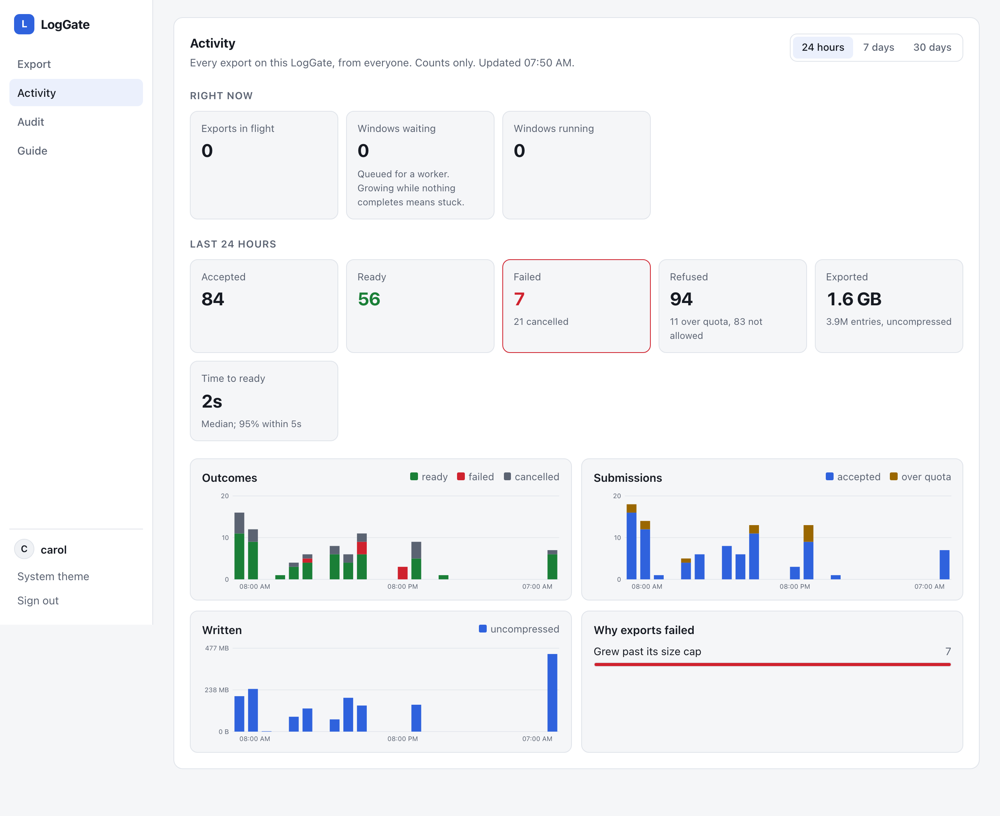

Operators have the same picture, and more, in Grafana: see
[the metrics section of the README](../README.md#metrics-and-dashboards).

The **Audit** tab (`#audit`) lists every time an export's data was handed to
someone, newest first: who, when, from which address, which export with its
clusters and namespaces, and how.

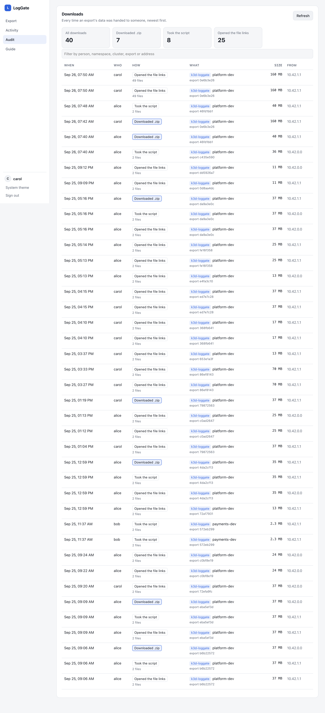

*How* is recorded as precisely as LogGate can know it:

- **Downloaded .zip.** The archive streamed through LogGate itself. Recorded
  as the download starts, because one abandoned halfway still handed over
  half the data.
- **Took the script** and **Opened the file links.** Each hands out links to
  the files, which are then fetched from storage directly, where LogGate
  never sees them. So these record that the links were issued, which is the
  last point LogGate can vouch for. The links to individual files are asked
  for only when someone opens *The files, individually* on a finished
  export, so looking at the page is not mistaken for a download.

The filter searches what is loaded; *Show older* loads further back.

## Downloading

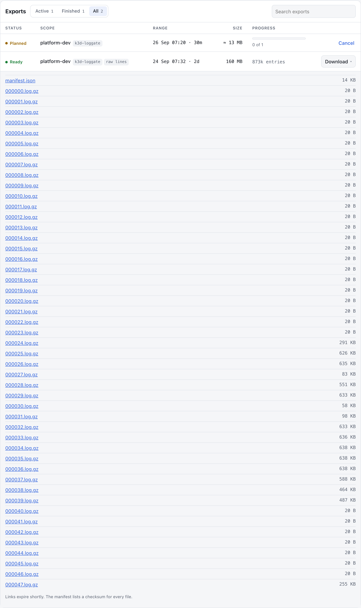

**Download** on a ready export offers three ways to collect it. LogGate
recommends one based on the size, by putting it in bold:

| Size | Recommended | Why |
| --- | --- | --- |
| Under 256 MB | **Download .zip** | Small enough for a browser. |
| 256 MB to 2 GB | Either | The script resumes if the connection drops. |
| 2 GB and over | **Download script** | An archive this size is not a browser download. |

**Download script** gives you a shell script. Run it anywhere with `curl`: it
downloads every file into a folder named after the export, resumes and retries
if the connection drops, and then checks each file against its SHA-256
checksum.

```bash
bash loggate-<export-id>-download.sh
```

**Download .zip** streams every file as one archive, through LogGate itself.
Convenient, but for large exports the script is faster and survives
interruptions.

**Files, individually** lists each file with a direct link, for when you only
want part of the range.

Two expiries apply, and the page tells you about both:

- **Download links expire shortly**: 30 minutes by default. They are signed, so
  they cannot be extended by editing them. If one has expired, reload the page
  or fetch the script again for fresh links.
- **The files are deleted** at the end of the retention period, shown under the
  download buttons as *These files are deleted in 2 days*. After that the export
  reads `EXPIRED`; run it again if you still need the data.

Access is checked again at download time. If you leave the owning team, you can
no longer fetch exports you made while you were in it; a link handed out before
you left still works until it expires.

If an export matched nothing, it says **No log lines matched** instead of
offering an empty download, and suggests what to check.

## What is in an export

| File | Contents |
| --- | --- |
| `manifest.json` | What the export is: the query and range it came from, the namespaces, entry and byte counts, and for every part its time window, size and SHA-256 checksum. It also lists any **caveats**, such as a range ending within the last 15 minutes, where some entries may still have been in transit to storage. |
| `000000.jsonl.gz`, `000001.jsonl.gz`, … | The logs, as gzipped JSON lines, one entry per line. The files are numbered in time order, and entries are in time order within each file. |
| `000000.log.gz`, `000001.log.gz`, … | The same, for an export made with *Raw log lines*: each line is the log line itself, nothing added. `zcat *.log.gz \| less` reads them in order. |

Each line is one log entry. This one, from the demo data, is spread over
several lines here to make it readable:

```json
{
  "timestamp": "1790012887203986968",
  "labels": {
    "namespace": "platform-dev",
    "pod": "platform-api-56f6bb49c6-q5zxw",
    "container": "api",
    "app": "platform-api",
    "service_name": "platform-api",
    "detected_level": "info",
    "instance": "platform-dev/platform-api-56f6bb49c6-q5zxw:api",
    "job": "loki.source.kubernetes.pods"
  },
  "line": "{\"ts\":\"2026-09-21T17:48:07+00:00\",\"level\":\"info\",\"msg\":\"request handled\",\"path\":\"/api/v1/things/1142801\",\"duration_ms\":51}\n"
}
```

- `timestamp` is nanoseconds since the Unix epoch, as a string so no precision
  is lost in tools that read numbers as floating point.
- `labels` are the Loki labels of the stream the line came from. Which labels
  there are depends on how your cluster ships its logs.
- `line` is the log line exactly as the pod wrote it, trailing newline included.
  If the pod logs JSON, as this one does, it is JSON inside a string, so
  `jq '.line | fromjson'` unpacks it.

Do not rely on the order of the keys within a line; it can vary.

Some ways to read them:

```bash
zcat *.jsonl.gz | jq -r .line                  # just the log lines
zcat *.jsonl.gz | jq -r 'select(.labels.pod | startswith("api-")) | .line'
zcat *.jsonl.gz | grep -i timeout               # plain text search
cat *.jsonl.gz > everything.jsonl.gz            # gzip files join into one valid file
```

## When something goes wrong

If an export fails, the reason is shown on the export in plain English.

| Shown as | What happened | What to do |
| --- | --- | --- |
| *This export produced more data than it was admitted for.* | It grew past the cap it was started with. | Narrow the time range or the pod pattern and try again. |
| *Loki stopped responding while this export was running.* | Loki kept failing after several retries. | It is safe to run it again. |
| *The export could not be written to storage.* | Object storage refused the files. | Tell whoever runs LogGate; this is not caused by your request. |

A finished export can say **You can no longer download this export** in place
of its download buttons. The files are there, but LogGate checks your access
again whenever anything is downloaded, and you no longer have access to all of
the export's namespaces: your team changed, or it was made while LogGate ran
in a different access mode. Someone with access can run it again.

An export can also be **refused before it starts**, with the reason given at
once: a range or size over the limit, too many exports already running, or your
team's budget being used up. The message says which, and by how much.

## Themes and phones

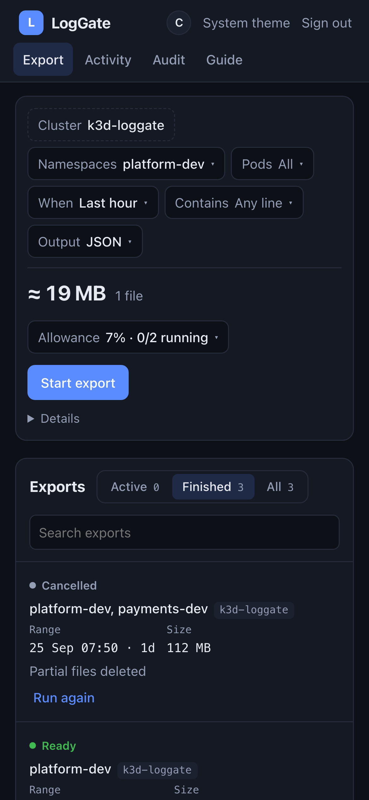

LogGate follows your system's light or dark setting. The button at the top of
the page switches between **System theme**, **Light** and **Dark**, and the
browser remembers your choice.

The page works at phone width. Starting a large export from your phone and
collecting it later from your laptop is fine: exports belong to you, not to the
browser that started them.

<br clear="right">

## Questions

**Why can't I see a namespace my team uses?**
In the team mode, either it has no team label, or its label names a team whose
group you are not in. LogGate never guesses; ask whoever owns the namespace to
label it or to add you to their group. In open mode, a namespace appears once
it has sent Loki a log line within the discovery window, a week by default.

**Why can I only choose one cluster?**
Your LogGate is in the team mode, which exports only from its own cluster
because that is the only one whose namespace owners it can check. Open mode
offers every cluster.

**Why is the download smaller than what is read from Loki?**
Because of your *Line contains* filter. Loki reads every line in the range to
find the ones that match, and quota counts that reading, because it is what
costs the platform.

**Why is a finished export bigger than the estimate?**
Logs keep arriving while an export runs, and each entry is written with its
timestamp and labels, which the estimate does not count. The manifest notes it
when an export came out larger than predicted.

**Can I write my own LogQL?**
No, on purpose. Choices made in the query bar can be sized, authorised and bounded
before anything runs; a free-form query cannot. For exploring logs
interactively, use Grafana.

**Is the data I download complete?**
For ranges that ended more than 15 minutes before the export, yes: every entry
Loki holds for the range. Entries that share the same nanosecond are all kept.
For a range reaching right up to the present, the manifest carries a caveat
that the most recent entries may still be arriving.

**Who can see what I exported?**
Only you can see your exports. Every export you start or cancel, every export
refused, and every attempt to reach a namespace you are not entitled to is
recorded in an audit log that the platform team can read.
